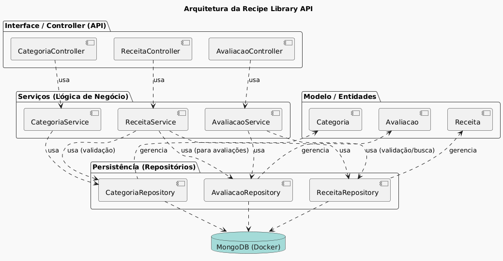

# 🍲 Recipe Library API (Spring Boot & MongoDB)

API RESTful desenvolvida em Java com Spring Boot para gerenciamento de receitas e suas avaliações. 

O projeto utiliza MongoDB como banco de dados e é totalmente conteinerizado com Docker Compose.

## Diagrama de arquitetura




## ✨ Funcionalidades Principais

* **Gerenciamento de Receitas:** CRUD básico para receitas.
* **Gerenciamento de Categorias:** Definição de categorias para organização.
* **Avaliações (Ratings):** Adição de notas e comentários por receita.
* **Auditoria:** Registro automático da data de criação das avaliações (`@CreatedDate`).
* **Validação:** Tratamento centralizado de erros de validação e regras de negócio.

## 🚀 Como Rodar o Projeto (Usando Docker Compose)

A maneira recomendada de rodar a API junto com o MongoDB é utilizando o Docker Compose.

### Pré-requisitos

Certifique-se de ter o **Docker** e o **Docker Compose** instalados em seu sistema.

### 1. Configuração de Variáveis de Ambiente

Crie um arquivo chamado `.env` na raiz do projeto com as seguintes variáveis de ambiente:

```.env 

MONGO_HOST=mongodb

MONGO_PORT=27017

MONGO_DB=recipelibrary

MONGO_USER=admin

MONGO_PASSWORD=korzre123

````
### 2. Build e Execução

Execute os comandos a seguir no terminal, na raiz do projeto:

```bash
# 1. Empacota a aplicação Java (cria o arquivo .jar)
./mvnw clean install

# 2. Constrói e inicia os serviços (API e MongoDB) em segundo plano
docker-compose up --build -d
````

## 📚 Endpoints da API

Todos os endpoints utilizam a base `http://localhost:8080/api/recipe`.

### 1. 🍽️ Receitas (`/api/recipe`)

| Método | Rota | Descrição |
| :--- | :--- | :--- |
| **`POST`** | `/` | Salva uma **nova receita**. Verifica se a receita já existe e se a categoria é válida. |
| **`GET`** | `/lista` | **Lista todas** as receitas cadastradas na plataforma. |

### 2. ⭐ Avaliações (`/api/recipe/evaluation`)

| Método | Rota | Descrição |
| :--- | :--- | :--- |
| **`POST`** | `/evaluation/{idReceita}` | Adiciona uma **avaliação (score e comentário)** a uma receita específica. |
| **`GET`** | `/evaluations` | Lista todas as avaliações de **todas** as receitas. |
| **`GET`** | `/evaluations/{idReceita}` | Busca uma receita específica e **inclui todas as suas avaliações**. |

### 3. 🏷️ Categorias (`/api/recipe/categoria`)

| Método | Rota | Descrição |
| :--- | :--- | :--- |
| **`POST`** | `/categoria` | Salva uma **nova categoria**. |
| **`GET`** | `/categoria/lista` | **Lista todas** as categorias registradas. |

---

## 📄 Exemplos de Payloads


### A. Criar Nova Categoria (`POST /api/recipe/categoria`)

```json
// PAYLOAD DE ENTRADA (CategoriaRequest)
{
  "nomeCategoria": "Sobremesa"
}

```

### B. Criar Nova Receita (`POST /api/recipe`)

```json
// PAYLOAD DE ENTRADA (ReceitaRequest)
{
  "nome": "Smoothie Verde Detox",
  "nomeCategoria": "Bebidas",
  "tempoPreparo": 5,
  "ingredientes": "1 copo de espinafre, 1 banana congelada, 1/2 maçã, 1 copo de água de coco.",
  "instrucoes": "Lave todos os ingredientes. Coloque-os no liquidificador na ordem indicada (líquidos primeiro) e bata até obter uma consistência suave e homogênea."
}

```

### C. Criar Nova Avaliação (`POST /api/recipe/evaluation/{idReceita}`)

O `{idReceita}` deve ser substituído pelo ID da receita na URL.

```json
// PAYLOAD DE ENTRADA (AvaliacaoRequest)
{
  "reviewerName": "Júnior",
  "score": 3,
  "comentario": "Receita fantástica e muito fácil de seguir! Adorei o resultado."
}
```

### D. Resposta de Busca Detalhada (`GET /api/recipe/evaluations/{idReceita}`)

```json
// PAYLOAD DE SAÍDA (Receita com Avaliações Embutidas)
{
  "nome": "Bolo de Cenoura Perfeito",
  "nomeCategoria": "Pastelaria",
  "tempoPreparo": 45,
  "ingredientes": "2 Cenouras, 3 Ovos, 2 Xícaras de Farinha, 1 Xícara de Açúcar",
  "instrucoes": "Misture os ingredientes secos. Bata os ovos com o óleo e a cenoura. Combine as misturas e asse por 45 minutos.",
  "avaliacaoResponse": [
    {
      "reviewerName": "João Silva",
      "score": 5,
      "comentario": "Receita fantástica e muito fácil de seguir! Adorei o resultado.",
      "date": "2025-12-10T06:42:05.810Z"
    }
  ]
}
````


